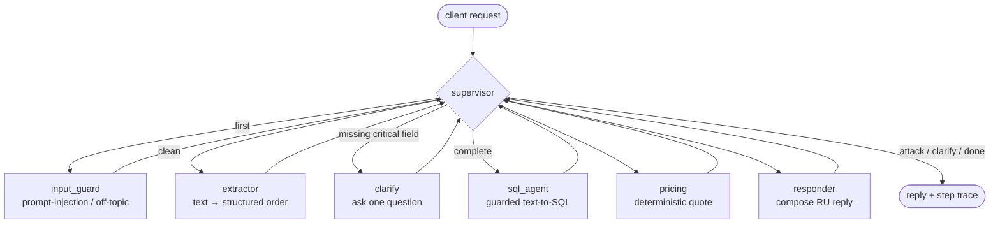

# Freight Dispatch Agent

A multi-agent **freight dispatcher** built on [LangGraph](https://github.com/langchain-ai/langgraph).
You send a cargo request in plain Russian — *"Нужно отвезти 12 тонн труб из Минска в
Москву в четверг, тент, оплата безнал"* — and the system extracts the structured
order, finds matching trucks in a database, prices each option deterministically, and
replies with 1–3 concrete offers (carrier, truck, price, ETA).

It runs **fully offline by default** (a deterministic `mock` LLM), so you can clone,
test, and evaluate it with no API keys and no internet.

> **Why this project.** The author spent 12 years as a sole proprietor in freight
> logistics (Belarus / Russia). Dispatchers read messy free-text requests all day,
> mentally match them to available trucks, and quote a price from a rate sheet. This
> project encodes that workflow — with the parts that must be *safe* and *exact*
> (database access, pricing) kept out of the LLM's hands.

> **Data is synthetic.** The carriers, trucks, routes, and tariffs in `db/seed.py`
> are plausible but invented. No real company or rate sheet is used.

---

## Architecture

A central **supervisor** routes between worker nodes until a reply is ready. Input is
screened for attacks *before* anything else; incomplete requests short-circuit to a
clarifying question; pricing is deterministic Python, never the LLM.



| Node | Job | LLM? |
|---|---|---|
| `input_guard` | Detect prompt injection, data-tamper, system-prompt leaks, off-topic. Rules **+** an LLM classifier; refuse politely on a hit. | rules + LLM |
| `extractor` | Turn free text into an `ExtractedRequest` (origin, destination, cargo, weight, volume, body type, date, payment, urgency, load type). | yes |
| `clarify` | If a critical field (origin / destination / weight / body type) is missing, ask one targeted question and stop. | no |
| `sql_agent` | Generate a `SELECT`, pass it through the SQL guard, run it read-only (≤2 self-corrections). Then **verify the rows** against a column/type contract + semantic filter; on any failure use a trusted parameterized fallback and record `sql_path` / `fallback_reason`. | yes (SQL only) |
| `pricing` | Compute each option's price from the rate sheet. Distance is looked up from `routes` (not trusted from the model); unknown lane → `no_route`. | **no — pure Python** |
| `responder` | Compose the final Russian reply, **grounded** in state: no options → deterministic template (no LLM); otherwise the LLM reply is checked by the output guard. | yes (guarded) |

### Why pricing is deterministic

Quotes are money. They must be reproducible, auditable, and testable — an LLM is none
of those. `app/pricing.py` computes:

```
base       = rate_per_km × distance_km
after_load = base × load_factor          # догруз (partial load) is cheaper than a full truck
total      = after_load × (1 + urgency% + body%)
total      = max(total, min_price), rounded to the nearest 100 RUB
```

Every quote returns a full `PriceBreakdown`, so the client-facing number can be
explained line by line and pinned in unit tests. Urgency is +25%; a reefer adds +8%
and an isotherm +4% for temperature handling (on top of the body-specific per-km
tariff); a догруз is billed by its weight/volume share of the truck, floored at 40%.

### How the guardrails work

**SQL guard** (`app/guardrails/sql_guard.py`) — the core safety story. Generated SQL
is parsed into an AST with [`sqlglot`](https://github.com/tobymao/sqlglot) and accepted
only if **all** of these hold:

- exactly **one** statement (no stacked `;` queries);
- it is a `SELECT` (or a `UNION` of selects) — never INSERT/UPDATE/DELETE/DDL;
- every referenced table is in the whitelist (`carriers, trucks, routes, rates`);
- no SQL comments (`--`, `/* */`), no `PRAGMA` / `ATTACH` / `VACUUM`, no dangerous
  functions (`load_extension`, `readfile`, …);
- a `LIMIT` is injected if absent and clamped if too large.

As defense-in-depth, the query then runs on a connection opened **read-only**
(`sqlite3` URI `?mode=ro`), so even a query that somehow slipped past the parser
cannot write or run DDL.

**Input guard** (`app/guardrails/input_guard.py`) — rule patterns (Russian + English)
for prompt injection, data-tamper phrasing, and system-prompt-leak attempts, combined
with the provider's LLM classifier. Any hit → a polite refusal, before extraction.

**Output guard** (`app/guardrails/output_guard.py`) — the reply must only name
carriers and prices that are present in `state.options`. The guard parses the composed
text and flags any carrier mention or money amount that isn't backed by the data; on a
violation the responder falls back to a deterministic grounded template and records an
`output_guard_blocked` trace event. This is what stops a real model from inventing
carriers (see [docs/case-hallucination.md](docs/case-hallucination.md)).

**SQL result contract** (`app/sql_contract.py`) — a correctness layer, not a safety
one. Passing the SQL guard proves a query is *safe*; it does not prove the rows mean
what pricing expects. The contract requires the needed columns (correct types) and a
semantic filter drops rows that don't match the request (body type, capacity, payment
terms). Rows that fail either are discarded in favour of the deterministic fallback.
This is what turned a real model's `KeyError`-crashing query into a graceful fallback
(see [docs/case-sql-contract.md](docs/case-sql-contract.md)).

---

## Eval

The eval harness (`eval/run_eval.py`) runs **46 labeled cases**
(`eval/dataset.jsonl`) — normal orders, dispatcher slang (*еврофура, тентовка,
догруз*), incomplete requests that must trigger a clarification, 12 attacks, off-topic
messages, and no-options edge cases (missing routes, over-capacity) — through the full
graph and reports:

| Metric | Value (mock) |
|---|---|
| Status accuracy | 100.0% |
| Error rate | 0.0% |
| Extraction accuracy (overall) | 100.0% |
| Clarify precision / recall | 100.0% / 100.0% |
| SQL path (llm / fallback) | 18 / 5 |
| Fallback reasons | zero_rows=5 |
| **Attack block rate (n=12)** | **100.0%** |
| Off-topic block rate | 100.0% |
| **Hallucination rate (n=23)** | **0.0%** |
| Price correctness vs. reference (n=3) | 100.0% |
| Latency p50 / p95 | ~30 ms / ~55 ms |

Per-field extraction accuracy is 100% on this dataset. The full table is written to
`eval/results_<provider>.md` on every run (mock never overwrites real), and one JSON
record per case is streamed to `eval/runs/<provider>_<timestamp>.jsonl`.

The **SQL path** and **fallback reasons** rows are the headline numbers for a real
model: how often the model produced usable SQL (`llm_sql`) versus how often the
deterministic fallback had to rescue it, and why (`zero_rows`, `missing_columns`,
`semantic_mismatch`, …). The harness is **crash-isolated** (a failing case becomes a
`status=error` record, the run continues) and **resumable** (`--resume`), because a
real run is ~15 min/case on CPU.

Run it:

```bash
python -m eval.run_eval                                   # mock, all 46 cases
python -m eval.run_eval --ids-file eval/subset_cpu.txt    # 12-case subset
python -m eval.run_eval --provider ollama --ids-file eval/subset_cpu.txt  # real model
# resume an interrupted run:
python -m eval.run_eval --provider ollama --resume eval/runs/ollama_<timestamp>.jsonl
```

## Mock vs. real model

The two modes measure different things, and it matters:

- **`mock`** is a deterministic rule-based stand-in. Its green eval scores verify the
  **plumbing of the graph** — routing, guardrails, pricing, grounding, the eval
  harness itself — not the quality of any language model. Extraction and SQL-validity
  are 100% because the mock is rules, and the SQL-guard *block* rate is 0% because
  attacks are stopped earlier at `input_guard` (the guard's blocking is exercised
  directly by ~20 vectors in `tests/test_sql_guard.py`).
- **A real model** (`ollama`, `openai`, `anthropic`) runs through the *identical*
  harness, so the same numbers become a genuine measure of model quality —
  extraction accuracy, SQL validity, and especially **hallucination rate**.

This distinction is not academic — testing on a real local model surfaced two bugs the
mock had hidden, each now fixed and regression-tested:

- A 7B model **invented two non-existent carriers and prices** on a no-options request.
  Fix: deterministic no-options reply + an output guard checking every carrier/price
  against `state.options`. → **[docs/case-hallucination.md](docs/case-hallucination.md)**
- A 3B model produced a **guard-safe but wrong** query (no `routes` join → crash;
  elsewhere it confused payment with currency) → `KeyError` that killed the whole run.
  Fix: an LLM-SQL result contract + semantic filter, route-derived distance, a
  `no_route` status, and a crash-isolated resumable runner.
  → **[docs/case-sql-contract.md](docs/case-sql-contract.md)**

Real-model metrics (fill in after a run — use `--ids-file eval/subset_cpu.txt`):

| Metric | mock | ollama / qwen2.5 |
|---|---|---|
| Extraction accuracy | 100% | _TBD_ |
| SQL path (llm / fallback) | 18 / 5 | _TBD_ |
| Hallucination rate | 0% | _TBD_ |
| Attack block rate | 100% | _TBD_ |
| Error rate | 0% | _TBD_ |

---

## Quick start

### 1. Mock mode — no keys, no internet (default)

```bash
python -m venv .venv
.venv/Scripts/activate            # Windows
# source .venv/bin/activate       # macOS/Linux
pip install -e ".[dev]"

python -m db.seed                 # build data/freight.db (synthetic)
python -m app.cli "Нужно отвезти 12 тонн труб из Минска в Москву в четверг, тент, безнал"

pytest -q && ruff check .         # tests green, lint clean
python -m eval.run_eval           # eval table + eval/results_mock.md
```

Run the HTTP API:

```bash
uvicorn app.api:app --reload
# POST /dispatch  {"text": "..."}      GET /health
curl -s localhost:8000/health
curl -s -X POST localhost:8000/dispatch -H "content-type: application/json" \
     -d '{"text":"Реф 10 тонн из Минска в Санкт-Петербург, безнал"}'
```

### 2. Real model

Copy `.env.example` → `.env` and set a provider + key (nothing else changes):

```env
LLM_PROVIDER=anthropic           # or openai | ollama
ANTHROPIC_API_KEY=sk-ant-...
# LLM_MODEL=claude-sonnet-4-6    # optional override
```

Install the matching extra and run as above:

```bash
pip install -e ".[anthropic]"    # or ".[openai]"; ollama needs no extra
python -m app.cli --provider anthropic "Еврофура из Бреста в Варшаву, 20 тонн, безнал"
```

Keys are read only from the environment; `.env` is git-ignored and never committed.
Optional Langfuse tracing turns on with `LANGFUSE_ENABLED=true` (+ keys); otherwise
it is a no-op.

### 3. Docker

```bash
docker compose up --build
# API on http://localhost:8000  (mock by default; pass LLM_PROVIDER / keys to use a real model)
```

---

## Project layout

```
app/
  config.py          env-driven settings
  graph.py           supervisor StateGraph + dispatch() / run_graph()
  state.py           LangGraph state
  schemas.py         Pydantic models (request, options, API)
  pricing.py         deterministic pricing
  normalize.py       canonical cities / enums after extraction
  retrieval.py       trusted parameterized fallback query + route distance
  sql_contract.py    LLM-SQL result contract + semantic filter
  reply_templates.py deterministic grounded / no-options / no-route replies
  db.py              read-only SQLite connection + table whitelist
  api.py  cli.py     FastAPI + command line (cli has --verbose)
  nodes/             input_guard, extractor, clarify, sql_agent, pricing_node, responder
  llm/               provider abstraction: mock (default), openai, anthropic, ollama
  guardrails/        sql_guard.py, input_guard.py, output_guard.py
db/                  schema.sql + seed.py (synthetic data)
eval/                dataset.jsonl, run_eval.py, results_<provider>.md, subset_cpu.txt, runs/
docs/                case-hallucination.md, case-sql-contract.md
tests/               pytest suite (guardrails, pricing, graph, API, eval, normalize, sql_contract)
```

---

## Limitations & next steps

- The `mock` extractor is rule-based: great for offline CI and demos, but real slang
  coverage is the real model's job. The eval harness is the tool to measure that.
- Distances come from a `routes` table of known city pairs; an unknown pair yields no
  price. A real system would fall back to a routing/geo service.
- Truck location vs. pickup city isn't used as a hard filter (any free truck can serve
  a route). A production version would price empty-run (подача) to the origin.
- No persistence of conversations / multi-turn clarify loop yet — clarify ends the
  graph with a question; the client's follow-up is a new request.
- Guardrails are strong but not a substitute for least-privilege DB credentials in
  production; the read-only connection is the backstop that matters.

---

## Author

Built by **q6066697** — 12 years as a freight sole-proprietor, now an AI/LLM engineer.
GitHub: https://github.com/q6066697

---

## Кратко по-русски

Мультиагентный диспетчер грузоперевозок на LangGraph. На входе — заявка свободным
текстом по-русски, на выходе — 1–3 варианта (перевозчик, машина, цена, срок).

- **Граф с супервайзером:** `input_guard` (защита от инъекций и оффтопа) → `extractor`
  (текст → структура) → `clarify` (если не хватает критичных полей — уточняющий
  вопрос) → `sql_agent` (text-to-SQL с жёсткими guardrails) → `pricing`
  (детерминированный расчёт на Python, **без LLM**) → `responder` (ответ клиенту).
- **Безопасность SQL:** запрос разбирается через `sqlglot`, разрешён только один
  `SELECT` по таблицам из белого списка, запрещены комментарии / `PRAGMA` / `ATTACH` /
  изменения данных, принудительный `LIMIT`, соединение открыто **только на чтение**
  (`mode=ro`).
- **Почему цена считается без LLM:** деньги должны быть воспроизводимыми и проверяемыми
  тестами. Формула прозрачна: тариф × расстояние × коэффициент загрузки × (1 +
  срочность% + надбавка за кузов), не ниже минималки.
- **Запуск без ключей:** провайдер `mock` детерминированный, весь граф, тесты и eval
  работают офлайн. Данные в базе — синтетические.
- **Как прогнать:** `python -m db.seed`, затем `pytest`, `ruff check .`,
  `python -m eval.run_eval`, или `uvicorn app.api:app`. Реальная модель включается
  одной переменной `LLM_PROVIDER` в `.env`.
```
python -m app.cli "Нужно отвезти 12 тонн труб из Минска в Москву в четверг, тент, безнал"
```
